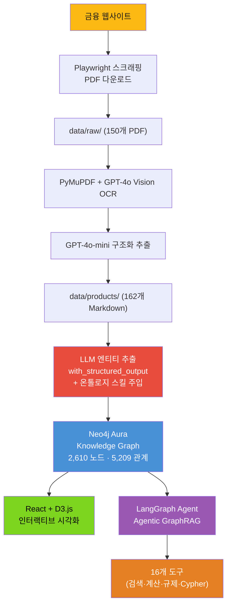
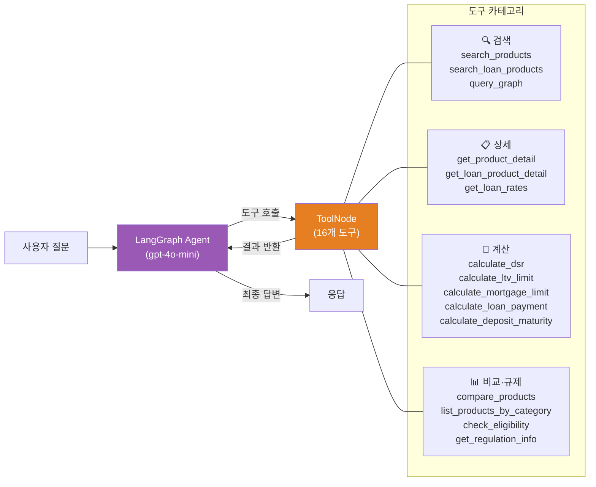
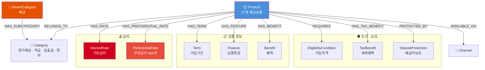
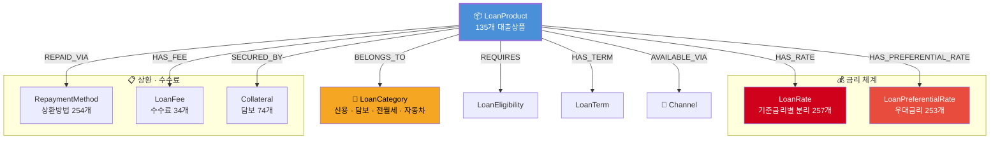

# 큽 금융상품 지식그래프

> **[Live Demo](https://bank-kg.duckdns.org/)** — 브라우저에서 바로 지식그래프를 탐색해보세요.

공개된 금융상품 정보를 수집하여 **Neo4j 지식그래프**로 구축한 개인 토이프로젝트입니다. LLM 기반 엔티티 추출로 162개 금융상품을 구조화하고, D3.js 시각화와 Agentic GraphRAG 챗봇을 제공합니다.

> **2,610개 노드 · 5,209개 관계 · 162개 금융상품 · 16개 에이전트 도구**

---

## 아키텍처



## Agentic Workflow

### LangGraph StateGraph 아키텍처



### 에이전트 도구 16개

| 카테고리 | 도구 | 기능 |
|---------|------|------|
| **검색** | `search_products` | Neo4j fulltext 예금/적금 검색 |
| | `search_loan_products` | Neo4j fulltext 대출 검색 |
| | `query_graph` | **Cypher 자동 생성 RAG** — 자연어 → Cypher 쿼리 |
| **상세** | `get_product_detail` | 예금 상세 (금리·우대·채널·보호) |
| | `get_loan_product_detail` | 대출 상세 (금리·상환·담보·수수료·소비자권리) |
| | `get_loan_rates` | 기준금리 유형별 (CD/COFIX/금융채) 금리 비교 |
| **계산** | `calculate_dsr` | **DSR 산출** (스트레스DSR 3단계, 기존부채 반영) |
| | `calculate_max_mortgage_by_dsr` | **DSR 한도 내 최대 대출 가능액** 역산 |
| | `calculate_ltv_limit` | **LTV 기반 한도** (규제지역/생애최초/가격대별) |
| | `calculate_mortgage_limit` | **LTV + DSR 종합 한도** |
| | `calculate_loan_payment` | 대출 상환액 (원리금균등/원금균등/만기일시) |
| | `calculate_deposit_maturity` | 예금 만기액 (세전/세후) |
| **비교·규제** | `compare_products` | 상품 비교 |
| | `list_products_by_category` | 카테고리별 목록 |
| | `check_eligibility` | 가입자격 확인 |
| | `get_regulation_info` | **부동산 규제 스킬** (LTV/DSR/생애최초) 조회 |

### DSR/LTV 계산 로직

금감원 DSR 산정기준 및 2025.10.15 대책을 반영한 정밀 계산:

```
스트레스 DSR = (신규대출 연상환액 + 기존부채 연상환액) / 연소득 × 100

신규대출 연상환액:
  적용금리 = 약정금리 + 스트레스가산금리 × 적용비율
  스트레스가산금리: 수도권 3.0%p, 지방 0.75%p
  적용비율: 변동 100%, 혼합5년 80%, 고정 0%

LTV 한도 (규제지역):
  무주택 40%, 생애최초 70%(최대 6억)
  주택가격대별 상한: 15억↓6억, 25억↓4억, 25억↑2억

최종 한도 = min(LTV 한도, DSR 한도)
```

### 스킬 시스템 (Lazy Loading)

규제 정보 등 도메인 지식을 스킬 파일로 분리하여 필요 시에만 LLM 컨텍스트에 로딩:

```
skills/
├── financial-regulations/     # 부동산 대출 규제 (LTV/DSR/생애최초)
├── dsr-calculator.md          # DSR 계산 가이드
└── ...
```

에이전트가 규제 관련 질문을 감지하면 `get_regulation_info` 도구로 스킬을 lazy 로딩 → 토큰 효율적.

---

## LLM 기반 엔티티 추출

기존 정규식 파서를 **LLM Structured Output**으로 대체:

```
MD 파일
  → LLM (gpt-4o-mini + Pydantic strict schema)
  → ExtractedDepositProduct / ExtractedLoanProduct
  → map_deposit() / map_loan() (content-hash ID)
  → Neo4j MERGE
```

### Foundry 온톨로지 스킬 주입

Palantir Foundry 온톨로지 스킬의 카탈로그 Object Type + Enum 정의를 LLM 시스템 프롬프트에 주입하여 도메인 인식 추출을 수행합니다.


---

## 온톨로지 설계

### 예금 도메인 (27개 상품)



### 대출 도메인 (135개 상품)



---

## 면책 조항 (Disclaimer)

- 본 프로젝트는 **개인 토이프로젝트**이며, 특정 금융기관과 어떠한 제휴 관계에 있지 않습니다.
- 수집된 정보는 공개된 금융상품 데이터를 구조화한 것이며, 비공개 정보나 내부 데이터는 포함되어 있지 않습니다.
- 제공되는 금융상품 정보는 **수집 시점 기준**이며, 실제 상품 조건과 다를 수 있습니다.
- **투자 권유가 아닌 정보 제공 목적**이며, 실제 금융 상담은 반드시 해당 금융기관에 문의하시기 바랍니다.

---

## 라이선스

MIT License

---

**마지막 업데이트**: 2026년 3월 26일
