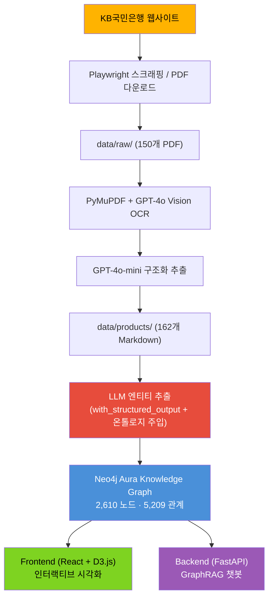
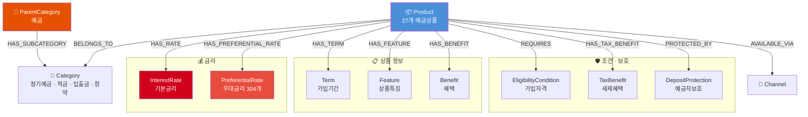
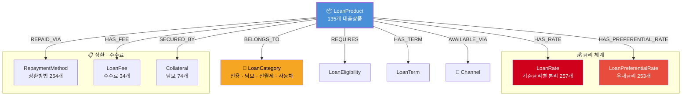

# KB국민은행 금융상품 지식그래프

> **[Live Demo](https://kb-kg.duckdns.org/)** — 브라우저에서 바로 지식그래프를 탐색해보세요.

KB국민은행 공식 웹사이트([obank.kbstar.com](https://obank.kbstar.com))에 **공개된 금융상품 정보**를 수집하여 **Neo4j 지식그래프**로 구축한 프로젝트입니다. LLM 기반 엔티티 추출로 162개 금융상품을 구조화하고, D3.js 시각화와 GraphRAG 챗봇을 제공합니다.

> **2,610개 노드 · 5,209개 관계 · 162개 금융상품**

---

## 아키텍처



### 핵심 기술 스택

| 계층 | 기술 |
|------|------|
| 데이터 수집 | Playwright, PyMuPDF, GPT-4o Vision OCR |
| 엔티티 추출 | **LangChain `with_structured_output(strict=True)`** + Foundry 온톨로지 스킬 주입 |
| 그래프 DB | Neo4j Aura (클라우드) |
| 백엔드 | FastAPI + LangGraph 에이전트 (7개 도구) |
| 프론트엔드 | React 19 + D3.js + TypeScript + Vite |
| 배포 | Docker + Oracle Cloud (Ubuntu 22.04) |

---

## LLM 기반 엔티티 추출

기존 정규식 파서를 **LLM Structured Output**으로 대체하여, Legacy 온톨로지의 깊이를 살린 추출을 수행합니다.

```
MD 파일
  → LLM (gpt-4o-mini + Pydantic strict schema)
  → ExtractedDepositProduct / ExtractedLoanProduct
  → map_deposit() / map_loan() (content-hash ID)
  → ParsedProduct (기존 builder 호환)
  → Neo4j MERGE
```

### Foundry 온톨로지 스킬 주입

Palantir Foundry 온톨로지 스킬의 카탈로그 Object Type + Enum 정의를 LLM 시스템 프롬프트에 주입하여 도메인 인식 추출을 수행합니다.

### 정규식 대비 개선점

| 항목 | 정규식 파서 | LLM 추출 |
|------|:---------:|:-------:|
| 금리 기준금리별 분리 (CD/COFIX/금융채) | X | O |
| 가산금리/우대금리 분해 | X | O |
| 통장자동대출/기한연장/연체금리 | X | O |
| 금액 문자열 자연어 파싱 | X | O |
| Legacy 서브클래스 (적립식/거치식/요구불) | X | O |
| 원문 보존 필드 | X | O |

---

## 온톨로지 설계

### 예금 도메인 (27개 상품)



### 대출 도메인 (135개 상품)



---

## GraphRAG 챗봇

LangGraph 기반 대화형 상담 챗봇으로, 7가지 도구를 통해 지식그래프를 쿼리합니다.

| 도구 | 기능 |
|------|------|
| `search_products` | Neo4j fulltext 검색 (CJK 지원) |
| `get_product_detail` | 상품 상세 + 관련 엔티티 조회 |
| `list_products_by_category` | 카테고리별 목록 |
| `compare_products` | 상품 비교 |
| `calculate_loan_payment` | 대출 상환액 계산기 |
| `calculate_deposit_maturity` | 예금 만기액 계산기 |
| `check_eligibility` | 가입자격 확인 |

---

## 실행 방법

### 데이터 파이프라인 (로컬)

```bash
# 1. PDF → Markdown
python -m scraper.parse_pdfs

# 2. Markdown → Neo4j (LLM 추출)
python -m knowledge_graph.llm_extractor data/products/

# 2-alt. Markdown → Neo4j (정규식 fallback)
python -m knowledge_graph.builder --all
```

### 서비스 (로컬 개발)

```bash
# 백엔드
pip install -e ".[chat]"
uvicorn backend.main:app --reload

# 프론트엔드
cd frontend && npm install && npm run dev
```

### Docker 배포

```bash
docker compose -f docker-compose.prod.yml up -d
```

---

## 면책 조항 (Disclaimer)

- 본 프로젝트는 **학술 및 포트폴리오 목적**의 비영리 프로젝트입니다.
- 모든 금융상품 정보는 [KB국민은행 공식 웹사이트](https://obank.kbstar.com)에 **일반에 공개된 정보**를 기반으로 수집되었으며, 비공개 정보나 내부 데이터는 포함되어 있지 않습니다.
- 수집된 정보는 **사실적 데이터**(상품명, 금리, 가입 조건 등)로서 지식그래프 형태로 구조화한 것이며, KB국민은행의 원본 콘텐츠를 그대로 재배포하는 것이 아닙니다.
- 본 프로젝트의 금융상품 정보는 **수집 시점 기준**이며, 실제 상품 조건과 다를 수 있습니다.
- 본 프로젝트는 KB국민은행과 어떠한 제휴 관계에 있지 않습니다.

---

## 라이선스

MIT License

---

**마지막 업데이트**: 2026년 3월 25일
