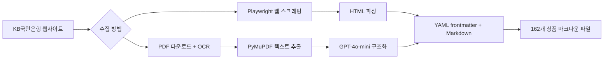
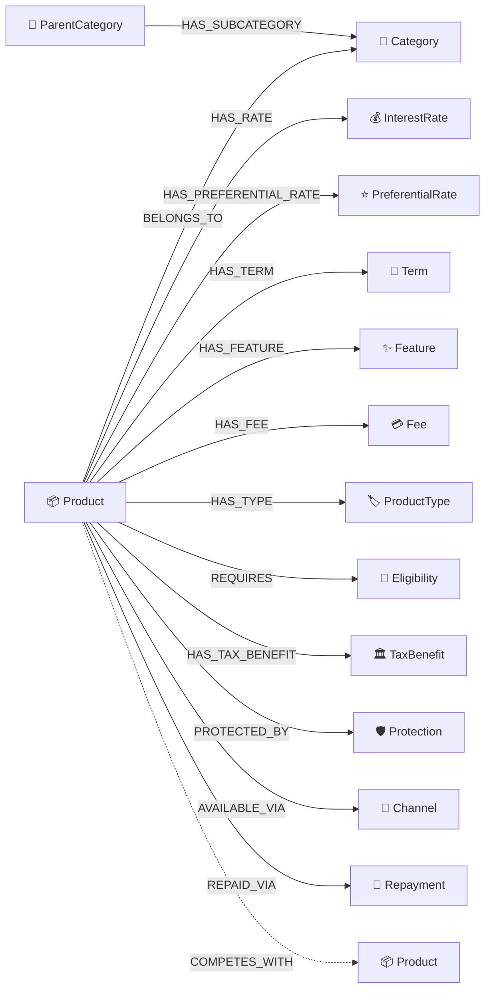
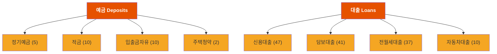
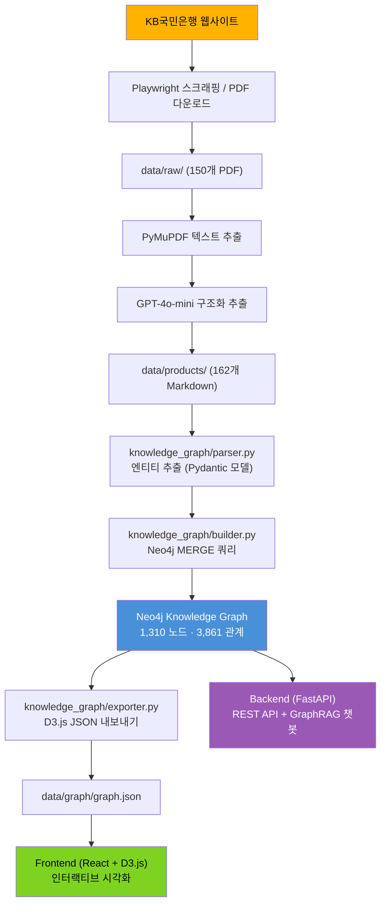
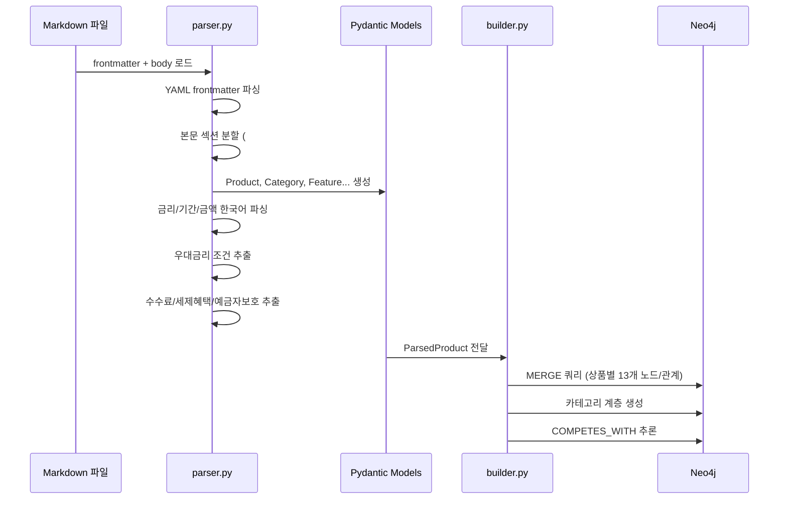
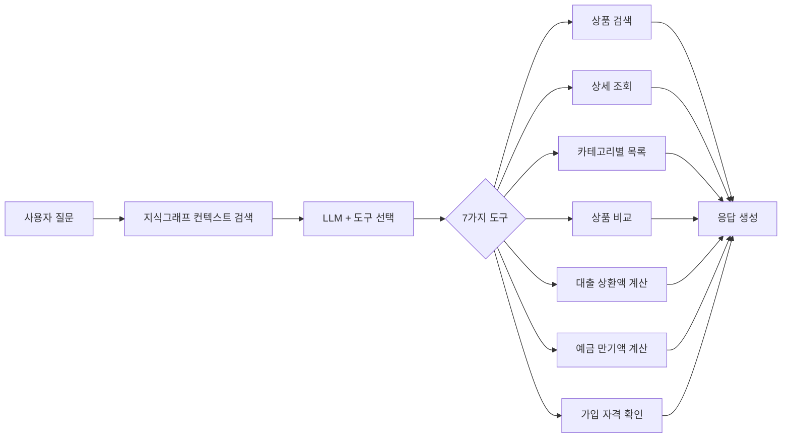

# KB국민은행 금융상품 지식그래프


> **[Live Demo](https://kb-kg.duckdns.org/)** — 브라우저에서 바로 지식그래프를 탐색해보세요.

KB국민은행 공식 웹사이트([obank.kbstar.com](https://obank.kbstar.com))에 **공개된 금융상품 정보**를 수집하여 **Neo4j 지식그래프**로 구축한 프로젝트입니다. 162개 금융상품을 14개 엔티티 타입과 14개 관계 타입으로 구조화하고, D3.js 기반 인터랙티브 시각화와 GraphRAG 챗봇을 제공합니다.

> **1,310개 노드 · 3,861개 관계 · 162개 금융상품**

---

## 데이터 수집

KB국민은행 웹사이트에서 두 가지 방법으로 금융상품 데이터를 수집합니다.



### 수집 경로별 상품 수

| 수집 방법 | 카테고리 | 상품 수 |
|----------|---------|--------|
| PDF 파싱 | 신용대출 | 47개 |
| PDF 파싱 | 담보대출 | 41개 |
| PDF 파싱 | 전월세대출 | 37개 |
| PDF 파싱 | 자동차대출 | 10개 |
| PDF 파싱 | 정기예금 | 5개 |
| PDF 파싱 | 적금 | 10개 |
| PDF 파싱 | 입출금자유 | 10개 |
| PDF 파싱 | 주택청약 | 2개 |
| **합계** | | **162개** |

### 데이터 파일 위치

| 경로 | 설명 | 파일 수 |
|------|------|--------|
| `data/raw/` | 스크래핑한 원본 PDF (카테고리별 하위폴더) | ~150개 |
| `data/products/` | PDF에서 파싱한 Markdown 파일 (카테고리별 하위폴더) | 162개 |
| `data/graph/graph.json` | D3.js 시각화용 그래프 JSON (노드+엣지) | 1개 (~1.3MB) |

### 마크다운 파일 구조

각 상품은 YAML frontmatter + 본문으로 구성됩니다.

```yaml
---
name: KB Star 정기예금
category: 정기예금
rates: 연 2.4% ~ 2.9%
terms: 1개월 이상 36개월 이하
channels: [인터넷, 스타뱅킹, 고객센터]
eligibility_summary: 개인 및 개인사업자
source: 'PDF: KB-Star-정기예금.pdf'
---
# KB Star 정기예금
## 상품설명
## 금리
## 가입대상
## 가입기간
## 우대금리
## 유의사항
```

### 한국어 데이터 처리

| 처리 항목 | 예시 | 변환 결과 |
|----------|------|----------|
| 금액 파싱 | "3백만원", "1억5천만원" | 3,000,000 / 150,000,000 |
| 기간 파싱 | "6~36개월", "최장 10년" | min=6, max=36 / max=120 |
| 금리 필터링 | "연 3.5%" (15% 초과 제거) | 3.5 |
| CJK 풀텍스트 | Neo4j fulltext index | 한글 검색 지원 |

---

## 온톨로지 설계

### 엔티티-관계 모델

```mermaid
graph TB
    PC["🏦 ParentCategory\n<i>예금 · 대출</i>"]
    C["📁 Category\n<i>정기예금 · 신용대출 등 9개</i>"]
    P["📦 Product\n<i>162개 금융상품</i>"]

    PC -->|HAS_SUBCATEGORY| C
    P -->|BELONGS_TO| C

    subgraph " 💰 금리 · 기간"
        IR["InterestRate\n<i>기본금리 16개</i>"]
        PR["PreferentialRate\n<i>우대금리 308개</i>"]
        T["Term\n<i>가입기간 141개</i>"]
    end

    subgraph " ✨ 상품 정보"
        F["Feature\n<i>특징 306개</i>"]
        FE["Fee\n<i>수수료 40개</i>"]
        PT["ProductType\n<i>상품유형 11개</i>"]
    end

    subgraph " 🛡️ 조건 · 보호"
        EC["EligibilityCondition\n<i>가입자격 161개</i>"]
        TB["TaxBenefit\n<i>세제혜택 28개</i>"]
        DP["DepositProtection\n<i>예금자보호 28개</i>"]
    end

    subgraph " 📱 이용 방법"
        CH["Channel\n<i>채널 10개</i>"]
        RM["RepaymentMethod\n<i>상환 12개</i>"]
    end

    P -->|HAS_RATE| IR
    P -->|HAS_PREFERENTIAL_RATE| PR
    P -->|HAS_TERM| T
    P -->|HAS_FEATURE| F
    P -->|HAS_FEE| FE
    P -->|HAS_TYPE| PT
    P -->|REQUIRES| EC
    P -->|HAS_TAX_BENEFIT| TB
    P -->|PROTECTED_BY| DP
    P -->|AVAILABLE_VIA| CH
    P -->|REPAID_VIA| RM
    P -.->|COMPETES_WITH| P

    style PC fill:#E65100,color:#fff,stroke:#E65100
    style C fill:#F5A623,color:#000,stroke:#F5A623
    style P fill:#4A90D9,color:#fff,stroke:#4A90D9,stroke-width:3px
    style IR fill:#D0021B,color:#fff,stroke:#D0021B
    style PR fill:#E74C3C,color:#fff,stroke:#E74C3C
    style T fill:#9B59B6,color:#fff,stroke:#9B59B6
    style F fill:#7ED321,color:#000,stroke:#7ED321
    style FE fill:#8E44AD,color:#fff,stroke:#8E44AD
    style PT fill:#16A085,color:#fff,stroke:#16A085
    style EC fill:#95A5A6,color:#000,stroke:#95A5A6
    style TB fill:#27AE60,color:#fff,stroke:#27AE60
    style DP fill:#2980B9,color:#fff,stroke:#2980B9
    style CH fill:#1ABC9C,color:#fff,stroke:#1ABC9C
    style RM fill:#E67E22,color:#fff,stroke:#E67E22
```



### 14개 엔티티 타입

| 엔티티 | 노드 수 | 설명 | 주요 속성 |
|--------|--------|------|----------|
| **Product** | 162 | 금융상품 | name, product_type, description, amount_max |
| **PreferentialRate** | 308 | 우대금리 조건 | name, rate_value_pp, condition_description |
| **Feature** | 306 | 상품 특징 | name, description |
| **EligibilityCondition** | 161 | 가입 자격 | description, min_age, target_audience |
| **Term** | 141 | 가입/대출 기간 | min_months, max_months, raw_text |
| **Fee** | 40 | 수수료 | fee_type, description |
| **TaxBenefit** | 28 | 세제혜택 | type (비과세/일반과세), eligible |
| **DepositProtection** | 28 | 예금자보호 | protected, max_amount_won |
| **InterestRate** | 16 | 기본금리 | rate_type, min_rate, max_rate |
| **RepaymentMethod** | 12 | 상환방법 | name (원리금균등/원금균등/일시상환) |
| **ProductType** | 11 | 상품유형 | name |
| **Channel** | 10 | 가입채널 | name (스타뱅킹/인터넷/영업점) |
| **Category** | 9 | 하위 카테고리 | name, name_en |
| **ParentCategory** | 2 | 상위 카테고리 | name (예금/대출) |

### 14개 관계 타입

| 분류 | 관계 | 시작 노드 | 끝 노드 | 설명 |
|------|------|----------|---------|------|
| **카테고리** | `BELONGS_TO` | Product | Category | 상품이 속한 카테고리 |
| | `HAS_SUBCATEGORY` | ParentCategory | Category | 상위→하위 카테고리 |
| **금리/기간** | `HAS_RATE` | Product | InterestRate | 기본 금리 |
| | `HAS_PREFERENTIAL_RATE` | Product | PreferentialRate | 우대금리 조건 |
| | `HAS_TERM` | Product | Term | 가입/대출 기간 |
| **상품 정보** | `HAS_FEATURE` | Product | Feature | 상품 특징 |
| | `HAS_FEE` | Product | Fee | 수수료 |
| | `HAS_TYPE` | Product | ProductType | 상품 유형 |
| **조건/보호** | `REQUIRES` | Product | EligibilityCondition | 가입 자격 조건 |
| | `HAS_TAX_BENEFIT` | Product | TaxBenefit | 세제 혜택 |
| | `PROTECTED_BY` | Product | DepositProtection | 예금자 보호 |
| **이용 방법** | `AVAILABLE_VIA` | Product | Channel | 가입 가능 채널 |
| | `REPAID_VIA` | Product | RepaymentMethod | 상환 방법 |
| **추론** | `COMPETES_WITH` | Product | Product | 같은 카테고리 경쟁 상품 |



### 카테고리 계층 구조



---

## 데이터 파이프라인



### 파서 동작 과정



---

## 시각화

D3.js 기반 인터랙티브 그래프 시각화를 제공합니다.

- **카테고리별 클러스터링**: 같은 카테고리 상품이 가까이 모여 표시
- **노드 크기 계층**: ParentCategory > Category > Product > 기타
- **클릭 선택**: 노드 클릭 시 연결된 노드/엣지 하이라이트, 비관련 노드 페이드
- **관계 타입별 엣지 색상**: 13가지 색상으로 관계 구분
- **카테고리 필터**: 특정 카테고리/노드 타입만 표시
- **줌/팬/드래그**: 자유로운 그래프 탐색

---

## GraphRAG 챗봇 (부가 기능)

지식그래프를 활용한 LangGraph 기반 대화형 상담 챗봇입니다.



- 사용자 본인의 OpenAI API 키를 프론트엔드에서 입력하여 사용
- Neo4j 없이도 정적 graph.json 기반으로 그래프/검색/상품 조회 가능

---

## 기술 스택

| 계층 | 기술 |
|------|------|
| **지식그래프** | Neo4j 5.x, Cypher, CJK Fulltext Index |
| **데이터 수집** | Playwright, PyMuPDF, GPT-4o-mini |
| **온톨로지** | Pydantic v2, 14 엔티티 타입, 14 관계 타입 |
| **백엔드** | FastAPI, LangChain, LangGraph |
| **프론트엔드** | React 19, TypeScript, D3.js 7, Vite |
| **인프라** | Docker, Oracle Cloud (Free Tier), Caddy (HTTPS) |

---

## 프로젝트 구조

```
KBBank_Knowledge_Graph/
├── knowledge_graph/          # 온톨로지 및 그래프 구축
│   ├── models.py             # 14개 Pydantic 엔티티 모델
│   ├── ontology.py           # 노드/관계 스키마 정의
│   ├── parser.py             # 마크다운 → 엔티티 추출
│   ├── builder.py            # Neo4j 그래프 구축
│   ├── exporter.py           # D3.js JSON 내보내기
│   ├── export_from_md.py     # Neo4j 없이 직접 내보내기
│   ├── query.py              # Cypher 쿼리 모음
│   ├── db.py                 # Neo4j 연결 관리
│   └── schema.cypher         # 제약사항 및 인덱스
│
├── scraper/                  # 데이터 수집
│   ├── run_scraper.py        # 메인 웹 스크래퍼
│   ├── download_pdfs.py      # 대출 PDF 다운로드
│   ├── download_deposit_pdfs.py  # 예금 PDF 다운로드
│   ├── parse_pdfs.py         # PDF → 마크다운 파싱
│   └── parse_missing_pdfs.py # 누락 PDF 증분 파싱
│
├── data/
│   ├── raw/                  # 원본 PDF (카테고리별 하위폴더, ~150개)
│   ├── products/             # 파싱된 마크다운 (카테고리별 하위폴더, 162개)
│   └── graph/graph.json      # D3.js 그래프 데이터 (1.3MB)
│
├── backend/                  # FastAPI 백엔드
│   ├── main.py               # 앱 진입점 (Neo4j 선택적)
│   ├── routers/              # REST API 엔드포인트
│   └── agent/                # LangGraph 챗봇 에이전트
│
├── frontend/                 # React + D3.js 프론트엔드
│   └── src/components/
│       └── GraphCanvas.tsx   # 인터랙티브 그래프 시각화
│
├── docker-compose.yml        # 로컬 개발용 (Neo4j + App)
├── docker-compose.prod.yml   # 프로덕션 배포용 (App 단독)
├── Dockerfile                # 멀티스테이지 빌드
└── deploy.sh                 # Oracle Cloud 배포 스크립트
```

---

## 면책 조항 (Disclaimer)

- 본 프로젝트는 **학술 및 포트폴리오 목적**의 비영리 프로젝트입니다.
- 모든 금융상품 정보는 [KB국민은행 공식 웹사이트](https://obank.kbstar.com)에 **일반에 공개된 정보**를 기반으로 수집되었으며, 비공개 정보나 내부 데이터는 포함되어 있지 않습니다.
- 수집된 정보는 **사실적 데이터**(상품명, 금리, 가입 조건 등)로서 지식그래프 형태로 구조화·변환한 것이며, KB국민은행의 원본 콘텐츠를 그대로 재배포하는 것이 아닙니다.
- 본 프로젝트의 금융상품 정보는 **수집 시점 기준**이며, 실제 상품 조건과 다를 수 있습니다. 정확한 정보는 반드시 [KB국민은행 공식 웹사이트](https://obank.kbstar.com)에서 확인하시기 바랍니다.
- 본 프로젝트는 KB국민은행과 어떠한 제휴·협약 관계에 있지 않습니다.

---

## 라이선스

MIT License

---

**마지막 업데이트**: 2026년 3월 24일
